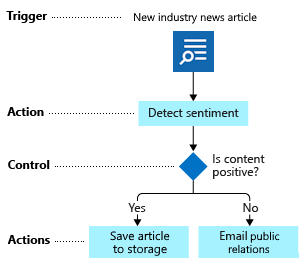
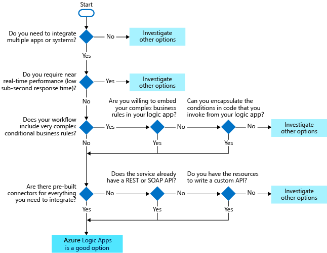

# Introduction
This is a summary of the core concepts and services in Azure Integration Services.
# Azure Logic Apps
- Azure Logic Apps is a cloud platform that helps you automate running your business process as a *logic app workflow*
- Focus of Azure Logic Apps is ***integration***
- Workflow designer is used to build a logic app workflow
- Azure Logic Apps execution engine runs the workflow
- Used to automate business processes as integration workflows that run in Azure cloud
- Visual designer with 1000+ prebuilt connectors available in browser as well as VS Code
## What is a connector?
- A *connector* is a component that provides an interface to a service or a system in form of *operations*
- A connector uses a service's ReST or SOAP API to do the actual work - it is a wrapper over the sevice/API
- Custom connectors can be created by uploading the Open API Specification of an API to the Azure Portal
## Trigger, Action, and Control

- A trigger is an event that happens when a specific condition is met e.g. timer, HTTP request
- An action is an operation that executes a specific task in the workflow
- Control actions are special actions that provide workflow control constructs:
    - Condition
    - Switch
    - Until and For loops
    - Unconditional parallel branch
## When to use Logic Apps?
- Logic Apps is **not** a good fit when there is no integration involved, when high performance is required since this service doesn't guarantee superfast activation or enforce real-time constraints; controls are simple, and finally connectors or atleast APIs are available

# Azure Functions
tbf
